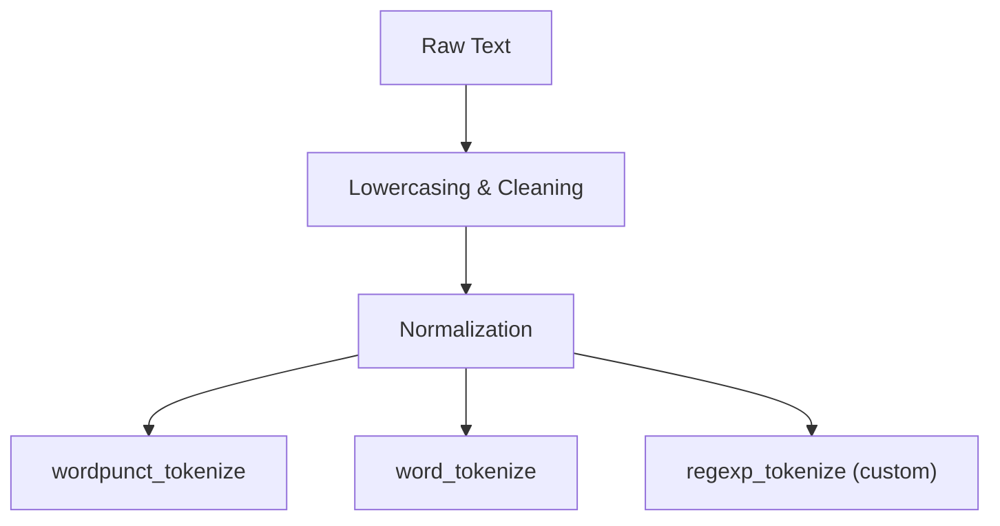

# 📝 Text Processing & Feature Extraction Roadmap

This repository documents the learning and practice steps for **text preprocessing, feature extraction, and embeddings** in Python using real Vietnamese text datasets.  

---

## 📂 Text Preprocessing  
### Task
- Preprocess the dataset  
- Report each preprocessing step and results  

### Visual Solution

### Techniques Covered
- Tokenizer  ✅
- Vectorization - I covered this in Text Feature Extraction
- Stopwords removal  
- Lemmatization - In my current knowledge, vietnamese does not have the word form like english so it hard or impossible to do this  
- Normalization  ✅

### Dataset
- [Vietnamese Online News Dataset (Kaggle)](https://www.kaggle.com/datasets/haitranquangofficial/vietnamese-online-news-dataset)  

### Tools / Libraries
- [NLTK](https://www.nltk.org/)  

---

## 📂 Text Feature Extraction  
### Task
- Apply 4 feature extraction techniques on the dataset  
- Compare and report results  

## 🧑‍💻 Workflow
1. **Load dataset** from JSON  
2. **Extract text content** (`docs = [d["content"] for d in data]`)  
3. **Preview samples** of raw text  
4. **Apply feature extraction methods**:
   - `CountVectorizer` (Unigram)  
   - `CountVectorizer` (Bigram)  
   - `TfidfVectorizer` (Unigram)  
5. **Inspect vocabulary** and feature space  
6. **Vectorize sample documents** to see feature representation  

### Techniques Covered
- Bag-of-Words ✅
- TF-IDF ✅
- Unigram ✅  
- Bigram ✅ 

### Dataset
- [Vietnamese Online News Dataset (Kaggle)](https://www.kaggle.com/datasets/haitranquangofficial/vietnamese-online-news-dataset)  

### Tools / Libraries
- [Scikit-learn: Text Feature Extraction](https://scikit-learn.org/stable/modules/feature_extraction.html)  

---

## 📂 Text Embeddings  
### Task
- Train Word2Vec embeddings on the dataset  
- Visualize embeddings (e.g., using PCA or t-SNE)  
- Report insights

## 🧑‍💻 Workflow
1. Load data → Read Vietnamese Wikipedia text (UTF-16).
2. Explore → Checked size & sample text.
3. Tokenize → Used NLTK to split into words.
4. Train embeddings → Word2Vec (vector_size=100, window=5, skip-gram, 10 epochs).
5. Track training → Logged + plotted loss per epoch.
6. Extract embeddings → Got embedding_matrix, word-to-index map.
7. Explore vocabulary → Printed sample words, embeddings.
8. Similarity check → Found most similar words (e.g., to “một”).
9. Visualize 10 random embeddings

### Techniques Covered
- Word2Vec ✅ 
- Average Word2Vec  
- Doc2Vec  

### Dataset
- [Vietnamese Wikipedia Dump (viwik18)](https://github.com/NTT123/viwik18)  

### Task
- Train Word2Vec embeddings on the dataset  
- Visualize embeddings (e.g., using PCA or t-SNE)  
- Report insights  

### Tools / Libraries
- [Gensim](https://radimrehurek.com/gensim/)  

---
